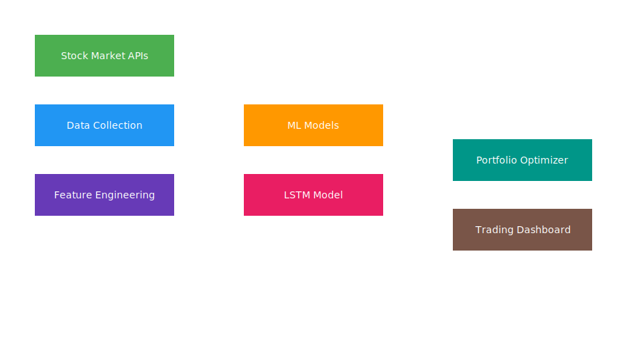

<h1 align="center">📈 AI Stock Prediction & Quant Trading Dashboard</h1>

An AI-powered stock market analysis platform built using Python, Machine Learning, and Deep Learning.

<h2>📊 Project Overview</h2>

This project builds an <b>AI-powered stock analysis and trading research platform</b>.
It combines machine learning, deep learning, portfolio optimization, sentiment analysis,
and interactive dashboards to simulate a simplified quantitative trading system.

The system collects real-time stock market data, analyzes historical trends, predicts
future returns, estimates risk, and provides trading signals.

<h2>🚀 Features</h2>

<h3>📡 Real-Time Market Data</h3>
<ul>
<li>Live stock data collection using Yahoo Finance API</li>
<li>Automatic updates for real-time prediction</li>
</ul>

<h3>🤖 Machine Learning Prediction</h3>
<ul>
<li>Random Forest regression model</li>
<li>Predicts expected stock returns</li>
<li>Uses engineered financial indicators</li>
</ul>

<h3>🧠 Deep Learning (LSTM)</h3>
<ul>
<li>Long Short-Term Memory neural network</li>
<li>Time-series forecasting for stock prices</li>
<li>Learns long-term market patterns</li>
</ul>

<h3>⚠ Risk Estimation</h3>
<ul>
<li>Volatility-based risk estimation</li>
<li>Standard deviation of returns</li>
<li>Helps evaluate investment safety</li>
</ul>

<h3>📉 Buy / Sell Signal Detection</h3>
<ul>
<li>Signals generated using predicted returns</li>
<li>BUY if expected return is positive</li>
<li>SELL if expected return is negative</li>
</ul>

<h3>📈 Interactive Charts</h3>
<ul>
<li>Interactive visualizations using Plotly</li>
<li>Real-time stock price movement</li>
<li>Model predictions vs actual prices</li>
</ul>

<h3>🔁 Strategy Backtesting</h3>
<ul>
<li>Test strategies on historical stock data</li>
<li>Compare strategy performance with market returns</li>
<li>Evaluate model reliability</li>
</ul>

<h3>💼 Portfolio Optimization</h3>
<ul>
<li>Uses Modern Portfolio Theory</li>
<li>Calculates optimal allocation across multiple stocks</li>
<li>Maximizes Sharpe Ratio</li>
</ul>

<h3>📰 News Sentiment Analysis</h3>
<ul>
<li>Fetches financial news using News API</li>
<li>Analyzes sentiment using NLP</li>
<li>Detects bullish or bearish market mood</li>
</ul>

<h3>🌐 Live Dashboard</h3>
<ul>
<li>Interactive web dashboard built with Dash</li>
<li>Displays charts, predictions, and signals</li>
<li>Runs locally in a browser</li>
</ul>

<h2>🧠 Machine Learning Pipeline</h2>

<pre>
Stock Market Data
        │
        ▼
Data Cleaning
        │
        ▼
Feature Engineering
        │
        ▼
Machine Learning Model
(Random Forest)
        │
        ▼
Deep Learning Model
(LSTM)
        │
        ▼
Return Prediction
        │
        ▼
Risk Estimation
        │
        ▼
Buy / Sell Signals
        │
        ▼
Portfolio Optimization
        │
        ▼
Interactive Dashboard
</pre>

<h2>📊 System Architecture</h2>

<h2>📈 Example Output</h2>

<pre>
Predicted Return: 0.0068
Estimated Risk: 0.0102
Trading Signal: BUY
</pre>

<pre>
Optimal Portfolio Allocation

AAPL : 30%
MSFT : 25%
NVDA : 20%
TSLA : 15%
AMZN : 10%
</pre>

<h2>⚙ Technologies Used</h2>

<ul>
<li>Python</li>
<li>Pandas</li>
<li>NumPy</li>
<li>Scikit-Learn</li>
<li>TensorFlow / Keras</li>
<li>SciPy</li>
<li>Plotly</li>
<li>Dash</li>
<li>Matplotlib</li>
<li>Yahoo Finance API</li>
<li>News API</li>
<li>TextBlob</li>
</ul>

<h2>📦 Installation</h2>

Clone the repository:

<pre>
git clone https://github.com/berasankhadeep20-lang/LLM-For-stock-market.git
cd ai-stock-dashboard
</pre>

Install dependencies:

<pre>
pip install -r requirements.txt
</pre>

<h2>▶ Running the Dashboard</h2>

<pre>
python stock_dashboard.py
</pre>

Open in your browser:

<pre>
http://127.0.0.1:8050
</pre>

<h2>📂 Project Structure</h2>

<pre>
ai-stock-dashboard
│
├── README.md
├── LICENSE
├── requirements.txt
├── architecture.svg
│
├── data_download.py
├── model_training.py
├── lstm_model.py
├── realtime_prediction.py
├── sentiment_analysis.py
├── portfolio_optimizer.py
├── backtesting.py
├── stock_dashboard.py
</pre>

<h2>🔮 Future Improvements</h2>

<ul>
<li>Transformer-based stock prediction models</li>
<li>Reinforcement learning trading agents</li>
<li>Multi-stock market scanning</li>
<li>Automated trade execution</li>
<li>Risk simulation models</li>
</ul>

<h2>⚠ Disclaimer</h2>

This project is for <b>educational and research purposes only</b>.
Stock markets are highly unpredictable and involve financial risk.

<h2>👨‍💻 Author</h2>

<b>Sankhadeep Bera</b> 
YouTube: https://youtube.com/@05sankhadeepbera78

<h2>⭐ Support</h2>

If you found this project useful, please consider giving it a ⭐ on GitHub.

